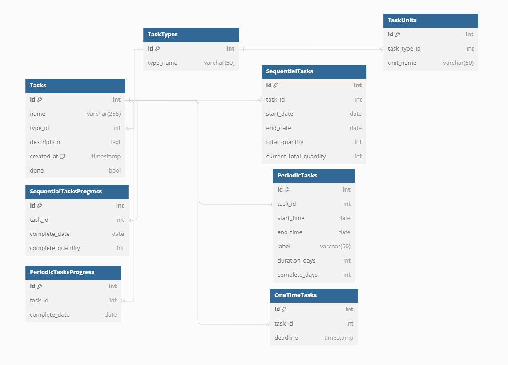

# ToDo-Assistant

## 🔥 运行

```
git clone https://github.com/pigBond/ToDo-Assistant.git
cd ToDo-Assistant
yarn install
yarn run dev
```

## 🔆 新功能


## 📝Thinkings

我想做一个任务规划软件，但是我不希望使用数据库来存储我的任务信息，~~我希望的形式是以文件的形式存储~~

以数据库的形式存储信息

我的项目中
我希望的功能有

一、任务清单

任务分为三种类型，分别为1.限时任务 2.周期任务 3.连续任务
其中限时任务需要一个截至日期，例如任务：交作业，截至日期2024-6-12-12：00
周期任务即在某个时间段内重复的工作，例如任务：睡午觉，任务开始时间13：00结束时间14：00，这样的任务每天都在重复，并且内容是相同的，这类任务可以加一个标签用来显示是否在指定时间段完成，例如睡午觉只能在固定时间段完成，而吃水果可以在一天中的任意时间段。注意这里的任务是这样设计的，是加入我今天设定了任务A，希望任务持续时间7天，那么该任务将在七天后结束，持续期间内每天都提示

连续任务是某个时间段内完成每日不相同但是相关的工作，例如任务：看完一本书，任务开始时间、任务结束时间，同样是可以设置是否在指定时间段完成。看一本书每天看的内容不同，而且因为各种原因每天的进度也不同，这本书我希望7天看完，那么我6-12看了40页，6-13看了50页，在勾选完成任务时需要手动输入今日进度情况，并且记录下来，如果不是看书，那么定量单位是不同的，所以后续这里应该尝试能够自定义任务类型，例如锻炼，设置每日进度单位为锻炼时长小时，即6-12锻炼2小时，6-13锻炼3小时，应给用户设计任务的接口

二、日历清单

以日历的形式展示每日的任务，这部分功能的实现需要能够清晰的定位每日的任务都有什么

三、周期、连续任务详情

分为两部分

第一部分：周期任务详情

以折叠面板的list的形式展示周期任务都有哪些，例如睡午觉、吃水果

点击睡午觉，展开面板，以日历打卡记录的形式展示任务完成情况，所以需要清晰的定位该任务的任务周期是什么？任务周期内哪些天完成了任务

第二部分：连续任务详情

同样以折叠面板的list的形式展示，例如 看书、锻炼

点击看书，展开面板，以折线图的形式展示每日阅读情况，例如6-12看了40页，6-13看了50页，第二个折现图展示总体进度情况，最后展示百分比，即任务完成了多少，所以需要清晰的定义该任务的总量是什么？


### 数据库设计



详情见[数据库设计](doc/database_design.md)

## 🛠️待办

- [ ] vue3基础框架构建
- [ ] electron框架构建
- [x] ~~任务信息存储标准设计，即如何将各种任务信息以文件的形式存储，不使用数据库~~ 使用数据库，这部分改为设计数据库
- [ ] 今日任务界面及功能实现
- [ ] 日历清单界面及功能实现
- [ ] 周期、连续任务详情界面及功能实现

## 🍀 致谢
