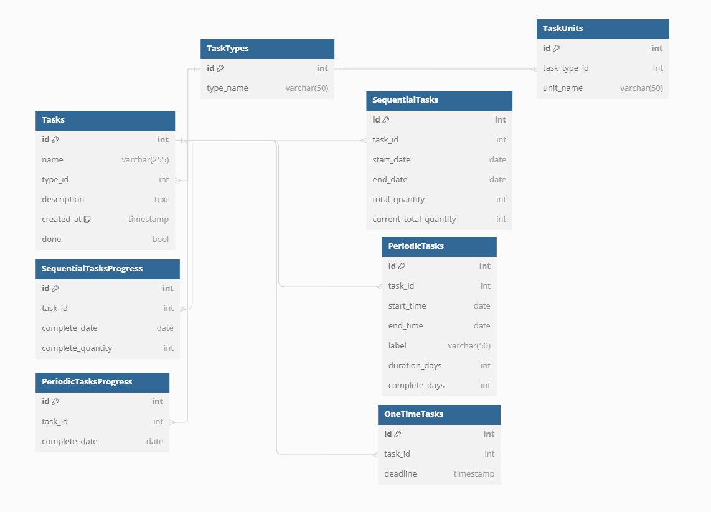

### 功能需求分析

1. **任务清单**
   - 三种任务类型：限时任务、周期任务、连续任务。
   - 限时任务需要截止日期。
   - 周期任务在特定时间段内重复，可能带有标签。
   - 连续任务在某个时间段内完成每日不同但相关的工作，记录每日进度，支持自定义进度单位。
2. **日历清单**
   - 以日历形式展示每日任务，清晰定位每日任务。
3. **周期、连续任务详情**
   - 周期任务详情：展示任务周期及完成情况。
   - 连续任务详情：展示每日进度情况和总体进度。

### 数据库设计图展示



### 数据库设计图代码

```sql
// 任务类型表
Table TaskTypes {
    id int [pk, increment]
    type_name varchar(50) [unique] // 任务类型名称，如限时任务、周期任务、连续任务
}

// 任务表
Table Tasks {
    id int [pk, increment]
    name varchar(255) // 任务名称
    type_id int [ref: > TaskTypes.id] // 任务类型ID
    description text // 任务描述
    created_at timestamp [default: `current_timestamp`] // 创建时间
    done bool // 任务是否完成
}

// 限时任务表
Table OneTimeTasks {
    id int [pk, increment]
    task_id int [ref: > Tasks.id, unique] // 任务ID
    deadline timestamp // 截止日期
}

// 周期任务表
Table PeriodicTasks {
    id int [pk, increment]
    task_id int [ref: > Tasks.id, unique] // 任务ID
    start_time date // 开始时间
    end_time date // 结束时间
    label varchar(50) // 标签
    duration_days int // 持续天数
    complete_days int // 已完成天数
}

//周期任务只要添加记录就说明该天已经完成任务，不添加记录就是没完成
// 周期任务进度记录表
Table PeriodicTasksProgress{
  id int [pk, increment] // 记录id
  task_id int [ref: > Tasks.id, unique] // 任务ID
  complete_date date // 本条记录记录时间 即 任务a在2024/6/12 17:00完成
}

// 连续任务表
Table SequentialTasks {
    id int [pk, increment]
    task_id int [ref: > Tasks.id, unique] // 任务ID
    start_date date // 开始日期
    end_date date // 结束日期
    total_quantity int // 总量
    current_total_quantity int // 当前完成的总量
}

//每次添加新记录时都要对当前任务总量进行修改
// 连续任务进度记录表
Table SequentialTasksProgress{
  id int [pk, increment] //记录id
  task_id int [ref: > Tasks.id, unique] // 任务ID
  complete_date date //本条记录记录时间 即 任务a在2024/6/12 17:00完成60点进度
  complete_quantity int //本次记录完成的量
}

// 任务进度单位表
Table TaskUnits {
    id int [pk, increment]
    task_type_id int [ref: > TaskTypes.id] // 任务类型ID
    unit_name varchar(50) // 进度单位名称，如页数、小时
    // unique(task_type_id, unit_name) // 任务类型和进度单位的联合唯一索引
}
```

### 致谢

https://dbdiagram.io/